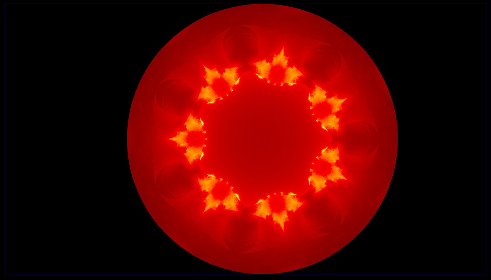

# fracgen_gpu
generating fractals on gpu

# some fractals generated using fracgen_gpu





# how to run
- clone repo
- ```cargo run --release```
- press
  - 1 for rendering plotquations
  - 2 for rendering buddhabrot
  - 3 for rendering mandlebrot
  - r for clearing image
  - p for dumping a render in ./images
  